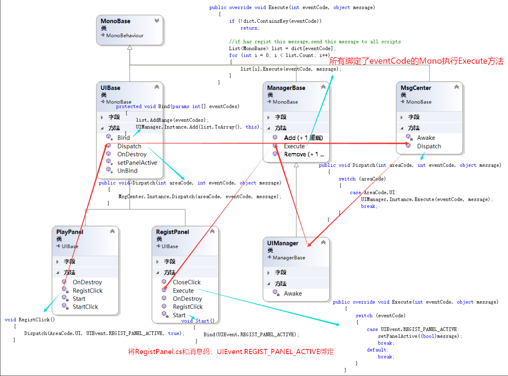

# 作品：斗地主

## 使用：
1.运行服务器，路径 Klandlord\Server\Server\Server\bin\Debug\Server.exe  
2.运行客户端，路径 Klandlord\Build\Klandlord.exe  

## 游戏过程:
注册->登陆->三个客户端准备->自动发牌->抢地主->获取底牌->开始打牌->游戏结束

## 前端点击注册逻辑执行过程:  
